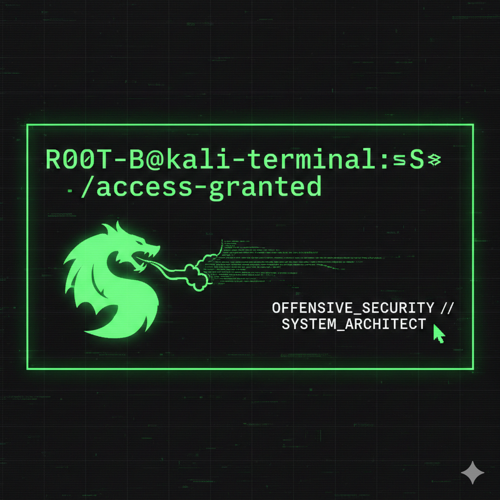

<p align="center">
  
  <p align="center">
  
  
  
</p>
</p>

<p align="center">
  
  
  
  
</p>

---

### 🖥️ [root@R00T-B ~]# access_granted --identity

```bash
┌──(root💀R00T-B)-[~]
└─$ whoami

Name: Burak Beştepe

Role: Offensive Security Specialist & System Architect

Location: Istanbul/Cyberspace

Motto: "Security is an illusion, privacy is a choice."

┌──(root💀R00T-B)-[/home/stats]
└─$ neofetch
Field,Data
OS,Kali GNU/Linux Rolling x86_64
Kernel,0x001B_Kernel
Shell,zsh / Burak-CLI
Tools,"Nmap, Metasploit, Burp Suite, SEO Frameworks"
Uptime,Constant Learning
┌──(root💀R00T-B)-[/projects]
└─$ ls -la
📁 r001B_Seo - drwxr-xr-x - Offensive UI & SEO Hub

📁 r001B.web - drwx------ - Custom web site

📁 Apex Secure AI - drwxr-xr-x - Automated Recon Module and Secure AI ENGİNE
┌──(root💀R00T-B)-[/home/contact]
└─$ cat secure_channel.txt
Email: bbestepe47@gmail.com
Link:(https://www.instagram.com/aydogdu1burak?igsh=MWNzczNsZHV5djI4cA%3D%3D&utm_source=qr)
└─$ logout
Connection to R00T-B closed.

## 🛠️ Skills & Technologies

For detailed technical skills, check out my [SKILLS.md](SKILLS.md) file.

### Quick Overview:
- **Python**: Security tools, automation
- **Bash Scripting**: System administration  
- **SQL**: Database security
- **Kali Linux**: Penetration testing

[View Full Skills Matrix](SKILLS.md)


### 📡 [SYSTEM_LOGS]: INCOMING_TRAFFIC
```bash connection_init: 192.168.1.104 bypass_success: authorization_granted r001B_Seo: module_loaded status: MONITORING_ACTIVE...
